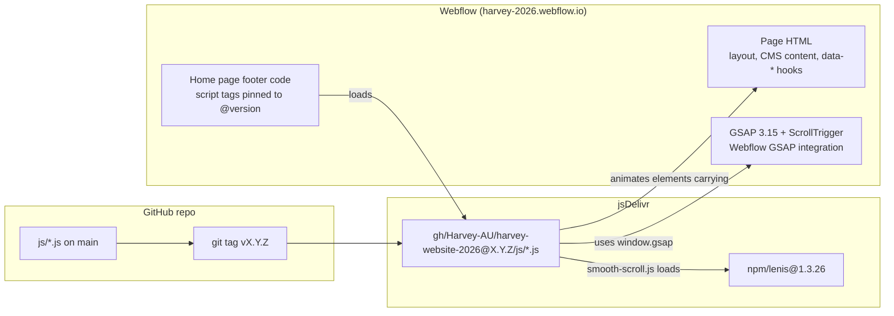
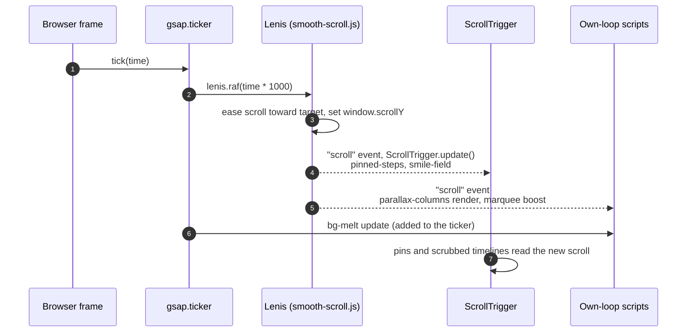
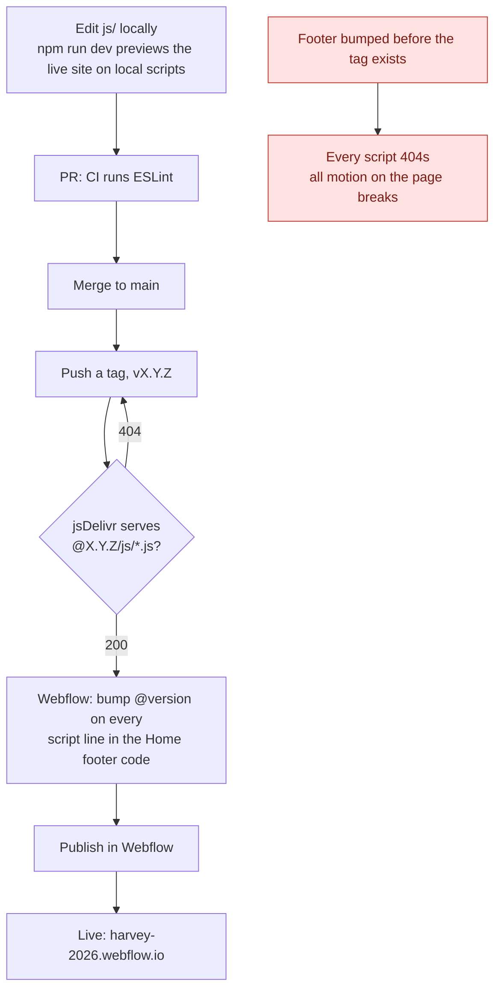
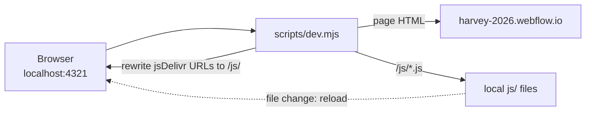

# Architecture

How the Harvey 2026 motion scripts get onto the page, how they share one frame loop with GSAP, and why a change needs a release before it shows up.

## What runs on the page

Webflow owns the page: layout, content, styling and the GSAP library.
This repo owns only the motion.
Each script finds elements by their `data-*` attribute and animates them, so nothing in Webflow references the code beyond the attribute and a script tag.

| Script | Hook | Needs GSAP | Follows Lenis |
| --- | --- | --- | --- |
| `smooth-scroll.js` | script tag (`data-lerp`) | Optional: drives Lenis from `gsap.ticker` when present | Creates it |
| `parallax-columns.js` | `[data-parallax-columns]` | No, own frame loop | Re-renders on each Lenis scroll |
| `pinned-steps.js` | `[data-pinned-steps]` | Yes, ScrollTrigger pin and scrub | Calls `ScrollTrigger.update()` |
| `smile-field.js` | `[data-smile-field]` | Yes, ScrollTrigger pin | Calls `ScrollTrigger.update()` |
| `marquee.js` | `[data-marquee]` | No, CSS animation | Reads velocity for the scroll boost |
| `bg-melt.js` | `[data-bg-melt]` | Optional: runs on `gsap.ticker` when present | Reads scroll position each tick |
| `work-explorer.js` | `[data-work-explorer]` | Yes, `gsap.quickTo` for the pan | No, pointer-driven |
| `nav-reveal.js` | `[data-nav-reveal]` | No | No (not on the page yet) |

Scripts that need GSAP check for `window.gsap` and `window.ScrollTrigger` and leave the page static without them, so a missing library degrades rather than throws.

## One frame loop: GSAP, Lenis and ScrollTrigger

Lenis replaces the browser's native wheel scrolling with an eased scroll.
Anything that reads the scroll position has to read it on the same frame Lenis moves it, or pinned sections jitter by a frame against the page.
So `smooth-scroll.js` hands Lenis to GSAP's ticker instead of letting Lenis run its own `requestAnimationFrame` loop, and turns off GSAP's lag smoothing so a slow frame never makes the two drift apart.

Start-up order matters only in one place.
`smooth-scroll.js` creates Lenis asynchronously (it loads the library from jsDelivr), then exposes it as `window.WebflowFramework.lenis` and fires `smoothScrollReady`.
Every other script either finds Lenis already there or waits for that event, so the script tags can load in any order.
The intro pin above `pinned-steps.js` is a Webflow Interaction, which shares the same global ScrollTrigger.
It measures before `pinned-steps.js`, so the later pin starts at the right scroll position.
Webflow Interactions do not hook into Lenis themselves; on the Home page `pinned-steps.js` already calls `ScrollTrigger.update()` on each Lenis scroll, which keeps them in step.

## Why a change needs a release

Webflow cannot host files from this repo, and it caches published pages.
So the scripts are served from jsDelivr, which mirrors GitHub, and the footer pins each URL to a git tag.
A tag never changes once pushed, which makes the live site predictable: it only changes when someone edits the footer and publishes.
Pushing to `main` alone changes nothing live.

If jsDelivr has already cached a 404 for a version (because the footer was bumped first), pushing the tag is not enough on its own.
Purge each file with `https://purge.jsdelivr.net/gh/Harvey-AU/harvey-website-2026@<version>/js/<file>.js`, then reload.

## Previewing without a release

`npm run dev` serves the live Webflow page through a local proxy that swaps the jsDelivr script URLs for the files in `js/`, and reloads the page when one changes.
Webflow's HTML, CSS and GSAP still come from the live site, so the preview matches production apart from the scripts under test.

